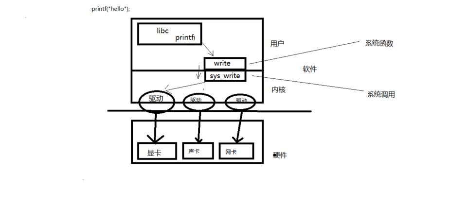

## 参考书


### 系统调用
```
系统调用是由操作系统实现并提供给外部应用程序调用的编程接口，
是应用程序和操作系统之间进行数据交换的桥梁。
```



- 如图所示描述builtin函数printf的执行过程

1. printf会调用write系统函数
2. write系统函数调用系统调用sys_write
3. 系统调用sys_write默认通过stdout输出内容到屏幕


### 常见的C标准库IO函数
```
1. fopen
2. fclose
3. fseek
4. fgets
5. fputs
6. fread
7. fwrite
```

- 常见的读写权限
```
1. r    只读
2. r+   读写
3. w    只写并截断为0
4. w+   读写并截断为0
5. a    追加只写
6. a+   追加读写
```
### open、close函数讲解

#### 函数原型
```
int open(const char *pathname, int flags);
int open(const char *pathname, int flags, mode_t mode);
int close(int fd);
```
#### 常用参数
1. O_RDONLY
2. O_WRONLY
3. O_RDWR
4. O_APPEND
5. O_CREAT
6. O_EXCL
7. O_TRUNC
8. O_NONBLOCK


