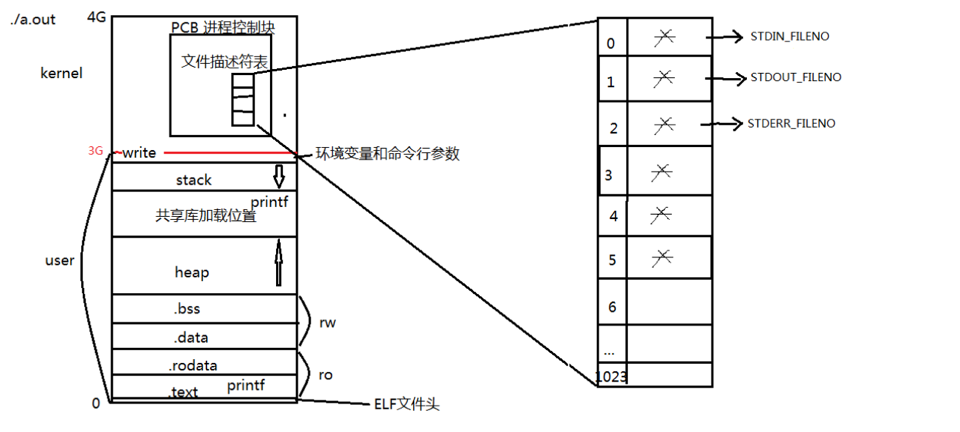

## 参考书


### 系统调用
```
系统调用是由操作系统实现并提供给外部应用程序调用的编程接口，
是应用程序和操作系统之间进行数据交换的桥梁。
```

<<<<<<< HEAD


- 如图所示描述builtin函数printf的执行过程

1. printf会调用write系统函数
2. write系统函数调用系统调用sys_write
3. 系统调用sys_write默认通过stdout输出内容到屏幕


### 常见的C标准库IO函数
```
1. fopen
2. fclose
3. fseek
4. fgets
5. fputs
6. fread
7. fwrite
```

- 常见的读写权限
```
1. r    只读
2. r+   读写
3. w    只写并截断为0
4. w+   读写并截断为0
5. a    追加只写
6. a+   追加读写
```
### open、close函数讲解

#### 函数原型
```
int open(const char *pathname, int flags);
int open(const char *pathname, int flags, mode_t mode);
int close(int fd);

详细信息： man 2 open
```
#### 常用参数
1. O_RDONLY
2. O_WRONLY
3. O_RDWR
4. O_APPEND
5. O_CREAT
6. O_EXCL
7. O_TRUNC
8. O_NONBLOCK

### PCB进程控制块


```
PCB是位于内核用于描述进程详细信息的结构体：struct task_struct

locate sched.h查看位置：	/usr/src/linux-headers-3.16.0-30/include/linux/sched.h
```

### 文件描述符表
结构体PCB中有一个file_struct *file结构体指向文件描述符表
每个进程都会自动创建三个文件描述符：
0. STDIN_FILENO     标准输入
1. STDOUT_FILENO    标准输出
2. STDERR_FILENO    标准错误

之后打开的文件所指向的fd号从4开始递增，直到1023
默认情况下，一个进程最多可以打开1024个fd，可以通过ulimit -n 修改


